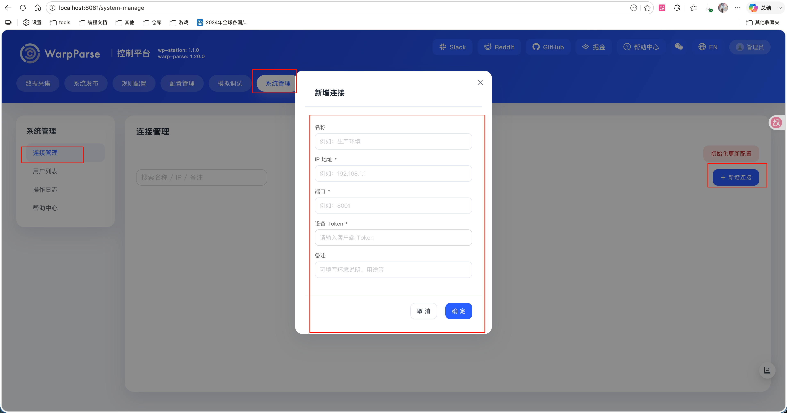

# warp-station

这个目录提供了一套企业版管理 wparse 的 Docker Compose 的本地运行环境，用来快速启动以下 3 个服务：

- `gitea`：git历史版本存储服务，默认暴露 `3000`、`222`
- `postgres`:账号存储服务，不暴露给外部。
- `warp-station`：wparse管理面板，默认端口 `8081`

## 环境变量

- 当前使用 `warp-station/.env` 管理配置；首次启动前可参考 `warp-station/.env.example` 生成。
- 当前默认包含以下变量：

```env
POSTGRES_USER=postgres
POSTGRES_PASSWORD=123456
GITEA_ADMIN_USERNAME=gitea
GITEA_ADMIN_PASSWORD=123456
WP_MONITOR_URL=http://host.docker.internal:18080
```

- `POSTGRES_USER`：内部 PostgreSQL 的账号名，同时会作为 Gitea 连接数据库时的用户名。
- `POSTGRES_PASSWORD`：内部 PostgreSQL 的密码，同时会注入到 `warp-station` 和 Gitea 的数据库配置中。
- `GITEA_ADMIN_USERNAME`：初始化 Gitea 时创建的管理员账号。
- `GITEA_ADMIN_PASSWORD`：初始化 Gitea 时创建的管理员密码，也会作为 `warp-station` 访问 Gitea 的密码。
- `WP_MONITOR_URL`：wp-monitor 的访问地址，当前 `.env.example` 中已预留该配置，建议按你的本地部署地址填写；它更偏向本地接入配置使用，不是当前 `docker-compose.yml` 直接消费的变量。

- 其中 `POSTGRES_USER` 和 `POSTGRES_PASSWORD` 属于内部基础设施配置，通常保持默认即可。
- `GITEA_ADMIN_USERNAME` 和 `GITEA_ADMIN_PASSWORD` 建议在首次部署时改成你自己的值。
- 如果本机不是通过 `http://host.docker.internal:18080` 访问 `wp-monitor`，请同步修改 `WP_MONITOR_URL`。

- 另外，`docker-compose.yml` 中还使用了 `STATION_ASSIST_BASE_URL` 来覆盖 `warp-station` 的 assist 服务地址：

```env
STATION_ASSIST_BASE_URL=
```

- 这个变量当前不在 `.env.example` 中，如果你需要覆盖 assist 服务地址，可以手动追加到 `.env`。

## 安装和启动

```bash
#安装
./setup.sh
#启动
./start.sh
```

## 接入方式
- 在wparse的`conf/wparse.toml`中添加如下监控配置
```toml
[admin_api]
enabled = true
bind = "127.0.0.1:19090"    #暴露给warp-station的端口
request_timeout_ms = 15000
max_body_bytes = 4096

[admin_api.auth]
mode = "bearer_token"
token_file = "runtime/admin_api.token"  # warp-station访问admin_api的token文件路径

[project_remote]
enabled = true
repo = "http://localhost:3000/gitea/project_root.git"   # warp-station中git仓库的地址，用来拉取项目配置
init_version = "1.0.0"
```

- 在`runtime/admin_api.token`中写入一个随机字符串作为token.
- 设置`admin_api.token`的权限为600，确保只有wparse进程可以读取。
```bash
chmod 600 runtime/admin_api.token
```
- 在wp-station的界面中配置admin_api的地址和token，完成连接测试后即可使用。
