### 前提介绍
假设当前目录为`/root/wp-stack`，用于持久化目录为`/data`。

### 下载镜像包和helm包
1. 在k8s所有机器上下载制品物料包，并解压。
```bash
wget https://nexus.corp.dy-sec.com/repository/dysec-general-anonymous/minhang/product-1.2.tgz
tar -zxvf product-1.2.tgz
# 进入到工作目录
cd product
```
物料包解压后目录结构如下所示：
```bash
product
├── helm
│   ├── wp-monitor
│   ├── wp-station
│   └── wparse
├── default-configs   # 生产环境的默认配置
│   ├── conf
│   ├── connectors
│   ├── models
│   └── topology
├── wparse            # 生产环境的实际配置
│   ├── conf
│   ├── connectors
│   ├── models
│   └── topology
├── wp-monitor-amd64-images.tar.gz
├── wp-station-amd64-images.tar.gz
└── wparse-amd64-images.tar.gz
```
2. 进入物料包后，将镜像加载到docker中：
```bash
gunzip -c wparse-amd64-images.tar.gz | docker load
gunzip -c wp-station-amd64-images.tar.gz | docker load
gunzip -c wp-monitor-amd64-images.tar.gz | docker load
```
3. 在集群的其他机器上也执行上面第1步和第2步的操作，确保每台机器上都有镜像。
    - 执行命令`kubectl get nodes`，查看所有集群机器。
    ```bash
    [root@dayu01 product]# kubectl get nodes 
    NAME                STATUS   ROLES    AGE    VERSION
    dayu01.shmh.dysec   Ready    master   197d   v1.19.5
    dayu02.shmh.dysec   Ready    master   197d   v1.19.5
    dayu03.shmh.dysec   Ready    master   197d   v1.19.5
    ```
    - 登录其他机器
    - 重复上面第1步和第2步的操作。

## 一键式部署
### 部署monitor
- 配置持久化目录，将图片中的路径改为实际路径(如果使用默认路径则无需修改):
    ``` bash
    vim helm/wp-monitor/values.yaml
    ```
    ```yaml
    victoriaMetrics:
      persistence:
        ath: "/data/victoria-metrics"
    victoriaLogs:
      persistence:
        path: "/data/victoria-logs"
    ```
    - 配置vlog
    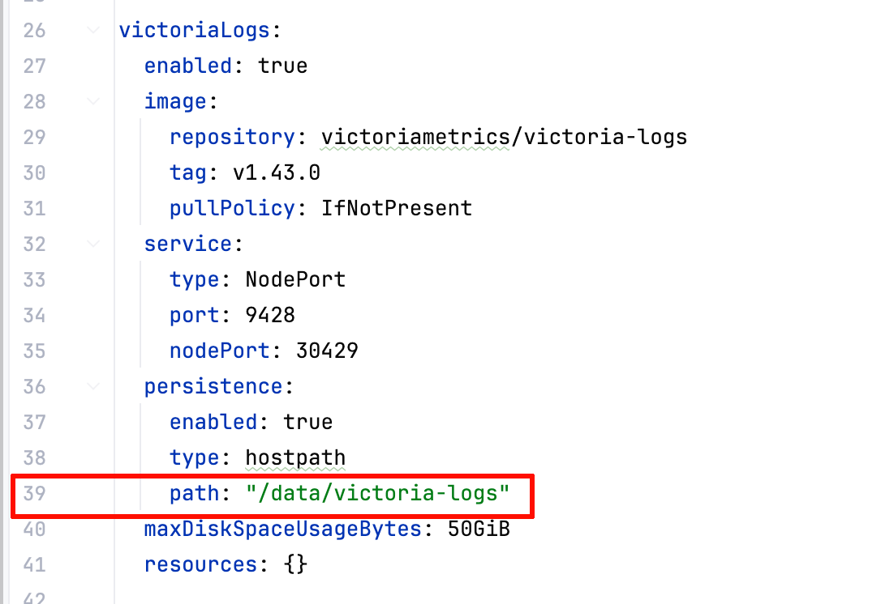
    - 配置vmetrics
    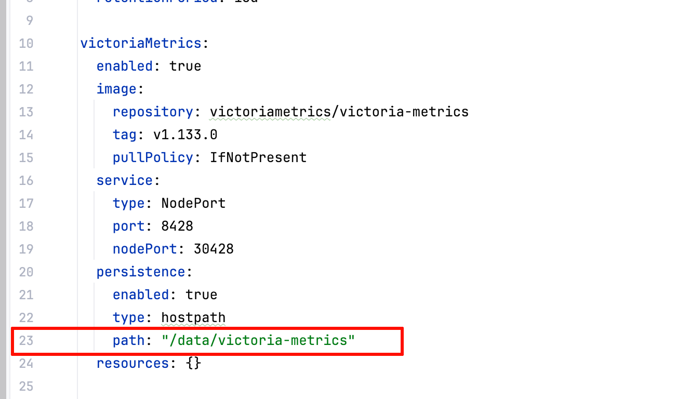
- 配置当前节点运行,在nodeSelector中设置当前节点：
    - 查看当前节点的名称:
    ```bash
    hostname
    ```
    - 设置victoriaMetrics和victoriaLogs的nodeSelector为当前节点的名称：
    ``` bash
    vim helm/wp-monitor/values.yaml
    ```
    将nodeSelector中的`kubernetes.io/hostname`,配置为当前节点名称(用hostname的结果替换掉`dayu01.shmh.dysec`)：
    ```yaml
    victoriaMetrics:
      nodeSelector:
        kubernetes.io/hostname: dayu01.shmh.dysec
    victoriaLogs:
      nodeSelector:
        kubernetes.io/hostname: dayu01.shmh.dysec
    ```
    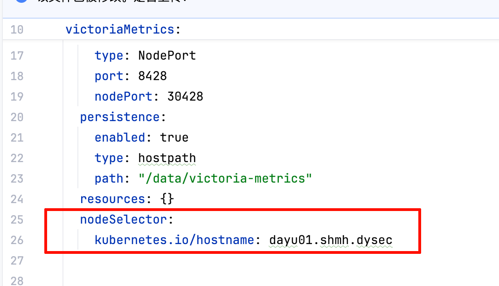
    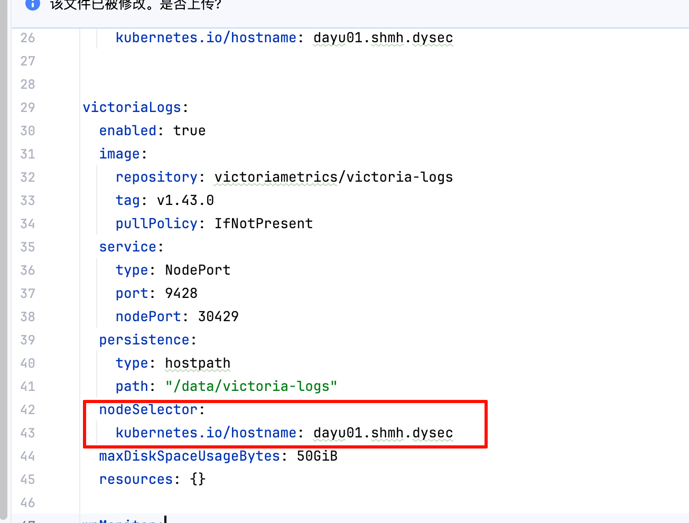
- 卸载
```bash
helm uninstall wp-monitor
```
- 启动
```bash
helm install wp-monitor ./helm/wp-monitor
```
- 更新
```bash
helm upgrade wp-monitor ./helm/wp-monitor
```
- 重启：先卸载再启动

- 查看运行状态
```bash
kubectl get po | grep wp-monitor
```
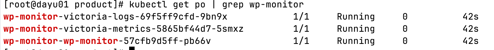

### 接入monitor
**在wparse中添加两个连接器**
- VictoriaMetrics connector
```bash
vim wparse/connectors/sink.d/80-victoriametrics.toml
```
使用下面配置覆盖掉该文件
```toml
[[connectors]]
id = "victoriametrics_sink"
type = "victoriametrics"
allow_override = ["endpoint", "api_path", "timeout_secs","batch_size"]
[connectors.params]
endpoint = "http://victoria-metrics:8428"
api_path = "/api/v1/import/prometheus"
timeout_secs = 3
```

- VictoriaLogs connector
``` bash
vim wparse/connectors/sink.d/70-victorialogs.toml
```
使用下面配置覆盖掉该文件
```toml
[[connectors]]
id = "victorialogs_sink"
type = "victorialogs"
allow_override = ["endpoint", "api_path", "flush_interval_secs", "create_time_field","batch_size","tags"]
[connectors.params]
endpoint = "http://127.0.0.1:9428"
api_path = "/insert/jsonline"
flush_interval_secs = 3
```

**在 sink_group 中接入监控**

``` bash
vim wparse/topology/sinks/infra.d/monitor.toml
```
使用下面配置覆盖掉该文件
```toml
[sink_group]
name = "monitor"

[[sink_group.sinks]]
name = "metrics_vmetrics_sink"
connect = "victoriametrics_sink"
[sink_group.sinks.params]
endpoint = "http://wp-monitor-victoria-metrics:8428"
api_path = "/api/v1/import/prometheus"
```

**在 sink_group 中接入miss数据**
```bash
vim wparse/topology/sinks/infra.d/miss.toml
```
使用下面配置覆盖掉该文件
```toml
[sink_group]
name = "miss"

[[sink_group.sinks]]
name = "victorialogs_output"
connect = "victorialogs_sink"
[sink_group.sinks.params]
endpoint = "http://wp-monitor-victoria-logs:9428"
api_path = "/insert/jsonline?_msg_field=content,log"
tags = ["wp_stage:miss"]
```

### 部署wparse
- 配置wparse的配置目录：
    - 查看上面的物料包中wparse的绝对路径，（以后对wparse自身配置修改，也是修改此目录的内容）：
    ```bash
    realpath wparse/
    ```
    
    - 设置helm中wparse的配置目录为上面查询到的绝对路径：
    ```bash
    vim helm/wparse/values.yaml
    ```
    
- 配置当前节点运行,在nodeSelector中设置当前节点：
    - 查看当前节点的名称:
    ```bash
    hostname
    ```
    - 设置wparse的nodeSelector为当前节点的名称：
    ``` bash
    vim helm/wparse/values.yaml
    ```
    将nodeSelector中的`kubernetes.io/hostname`,配置为当前节点名称(用hostname的结果替换掉`dayu01.shmh.dysec`)：
    ```yaml
    wparse:
      nodeSelector:
        kubernetes.io/hostname: dayu01.shmh.dysec
    ```
    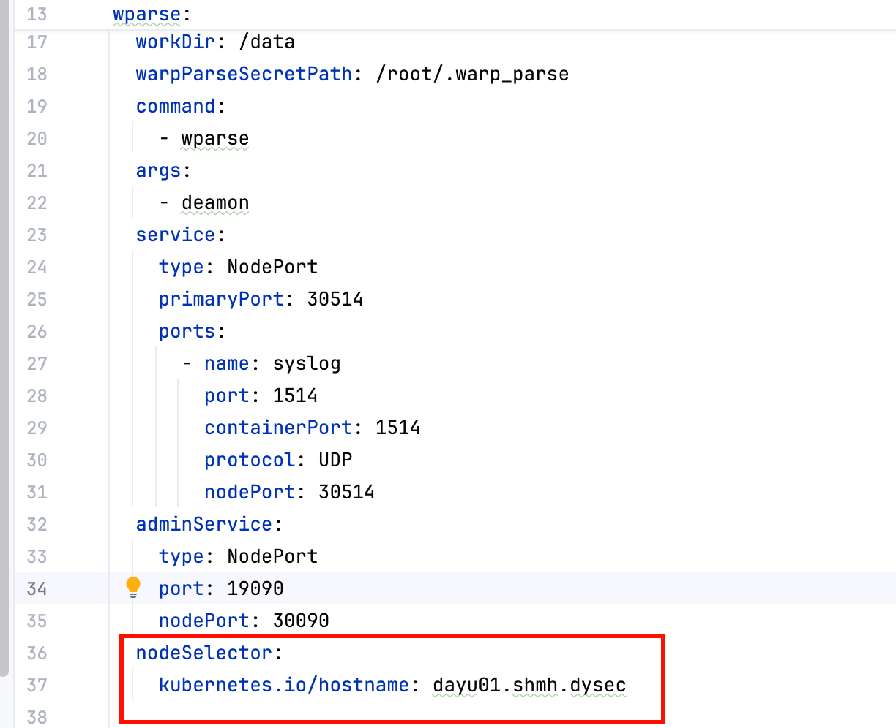

- 配置wparse的source端口（根据需求判断是否要配置此步骤）,wparse source中的端口需要暴露给外部访问，因此需要将source用到的端口**追加**到`wparse.service.ports`中。
    ``` bash
    vim helm/wparse/values.yaml
    ```
    


- 安装
```bash
helm install wparse ./helm/wparse
```
- 卸载
```bash
helm uninstall wparse
```
- 更新
```bash
helm upgrade wparse ./helm/wparse
```
- 重启：先卸载再启动

- 查看运行状态
```bash
kubectl get po | grep wparse
```
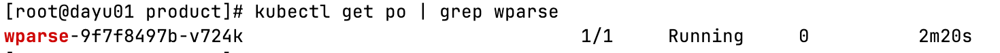

### 部署station
- 配置pg和gitea的持久化目录，将图片中的路径改为实际路径(如果使用默认路径则无需修改):
    ```bash
    vim helm/wp-station/values.yaml
    ```
    ```yaml
    postgres:
      persistence:
        path: "/data/postgres"
    gitea:
      persistence:
        path: "/data/gitea"
    ```
    - pg
    
    - gitea
    
- 配置wp-station的默认wparse配置：
    - 将实际的default-configs目录覆盖掉默认的`default-configs`目录（如果有）。
    - 查看上面物料包中default-configs的绝对路径：
    ```bash
    realpath default-configs/
    ```
    
    - 设置helm中wp-station的default-configs目录为上面查询到的绝对路径：
    ```bash
    vim helm/wp-station/values.yaml
    ```
    
- 配置当前节点运行,在nodeSelector中设置当前节点：
    - 查看当前节点的名称:`hostname`
    - 设置station、pg、gitea的nodeSelector为当前节点的名称：
    ``` bash
    vim helm/wp-station/values.yaml
    ```
    将nodeSelector中的`kubernetes.io/hostname`,配置为当前节点名称(用hostname的结果替换掉`dayu01.shmh.dysec`)：
    ```yaml
    station:
      nodeSelector:
        kubernetes.io/hostname: dayu01.shmh.dysec
    pg:
      nodeSelector:
        kubernetes.io/hostname: dayu01.shmh.dysec
    gitea:
      nodeSelector:
        kubernetes.io/hostname: dayu01.shmh.dysec
    ```
    
    
    
- 安装
```bash
helm install wp-station ./helm/wp-station
```
- 卸载
```bash
helm uninstall wp-station
```
- 更新
```bash
helm upgrade wp-station ./helm/wp-station
```
- 重启：先卸载再启动
- 查看运行状态
```bash
kubectl get po | grep wp-station
```
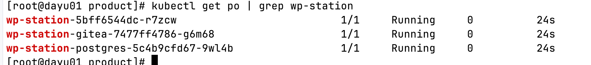

### 暴露端口
- monitor：宿主机30880,容器18080.
- vlogs: 宿主机30429,容器9428.
- vmetrics: 宿主机30428,容器8428.
- station：宿主机30881,容器8081。
- wparse syslog监听端口：宿主机30514,容器1514(source监听端口)。
- wparse admin模块监听端口：宿主机30090,容器19090(admin api)。

### 验证monitor
- 使用wpgen发送数据，将下面内容**覆盖**掉`wparse/conf/wpgen.toml`中
```bash
vim wparse/conf/wpgen.toml
```

``` toml
version = ""

[generator]
mode = "rule"
count = 10000
speed = 1000
parallel = 1

[output]
connect = "syslog_udp_sink"
[output.params]
addr = "127.0.0.1"
port = 30514

[logging]
level = ""
module_levels = []
output = ""
file_path = "./data/logs"

[presets]

```

- 进入到wparse目录
```bash
cd wparse/
```
- 启动wpgen
```bash
wpgen sample -n 1000 --stat 1 -p
```
- 等待一分钟后访问宿主机monitor端口：30880查看效果


### 验证station
**验证**：访问宿主机 30881端口
- 登录：用户名为admin，密码为123456

- 创建一个连接，设备token为123456


- 显示为在线即成功


## 定制化部署
如果不需要定制化，则无需下面操作。

### 部署wp-monitor
以下的values文件均是指`wparse/values.yaml`。
- 配置monitor镜像（可选）:修改values文件的`wpMonitor.image`的repository和tag。

- 默认监听宿主机30880端口，通过`wpMonitor.service.nodePort`配置

- 安装
```bash
helm install wp-monitor ./wp-monitor
```
**验证**：访问`106.52.231.222:30880`（此时只有页面，没有数据）
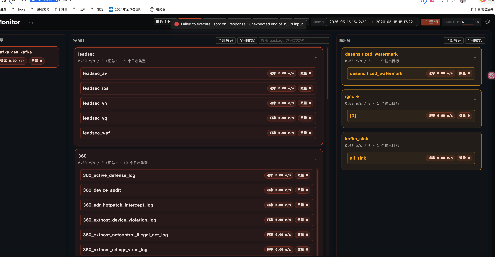

### 部署wparse
以下的values文件均是指`wparse/values.yaml`。

- 配置wparse镜像（可选）:修改values文件的`wparse.image`的repository和tag

- 配置wparse配置目录: 
    - 修改values文件的`wparse.config.type` 为`hostpath`,并指定`wparse.config.path`为实际的wparse目录`/data/work`
    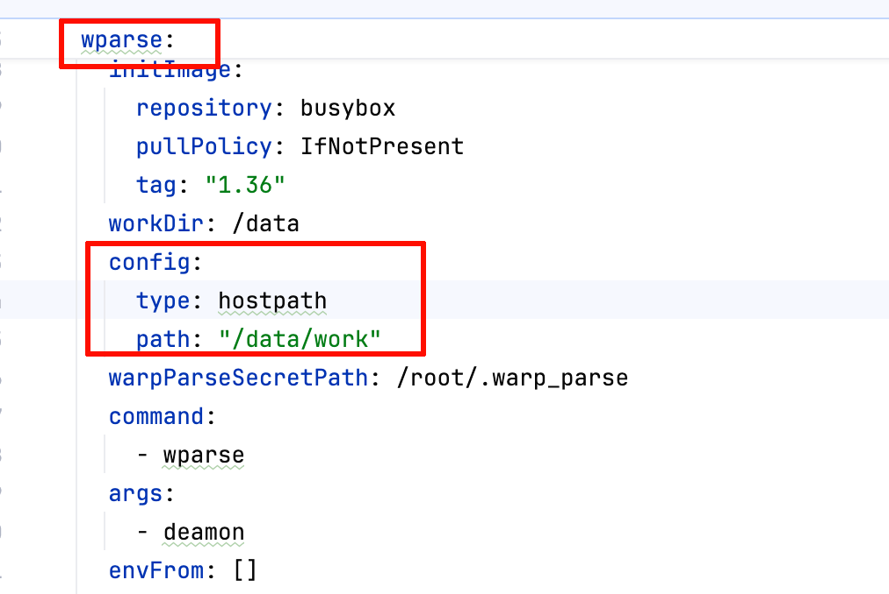
    - 修改values文件的`wparse.nodeSelector`，添加一个`kubernetes.io/hostname: dayu01.shmh.dysec` 标签，用来设置wparse的运行机器。
    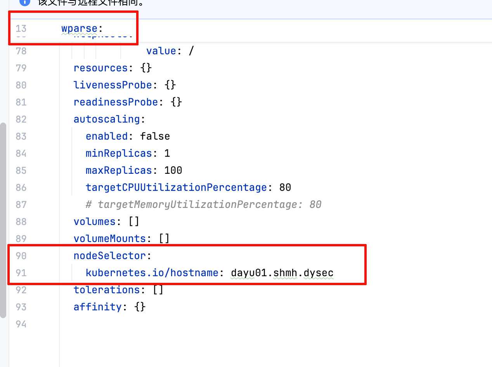
- 配置端口（可选）：对于wparse的source所监听的端口，需要在`wparse.service.ports`中添加端口信息。如果想要集群外部可以访问，则配置`wparse.service.type`为`NodePort`.
- 布置证书（可选）：将tls证书放到`wparse/.warp_parse/tls`目录下，将`admin_api.token`放到`wparse/.warp_parse`目录下（不要放在`/data/work`中）。
- 安装
```
helm install wparse ./wparse
```

**验证**：可以看到带有这个前缀的pod在运行，且状态为runing:`kubectl get po | grep parse`
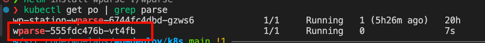


### 接入monitor
**在wparse中添加两个连接器**

- VictoriaMetrics connector
使用下面配置**覆盖**掉在此文件内容`/data/work/connectors/sink.d/80-victoriametrics.toml`

``` bash
vim /data/work/connectors/sink.d/80-victoriametrics.toml
```

```toml
[[connectors]]
id = "victoriametrics_sink"
type = "victoriametrics"
allow_override = ["endpoint", "api_path", "timeout_secs","batch_size"]
[connectors.params]
endpoint = "http://victoria-metrics:8428"
api_path = "/api/v1/import/prometheus"
timeout_secs = 3
```

- VictoriaLogs connector
使用下面配置**覆盖**掉在此文件内容`/data/work/connectors/sink.d/70-victorialogs.toml`

``` bash
vim /data/work/connectors/sink.d/70-victorialogs.toml
```

```toml
[[connectors]]
id = "victorialogs_sink"
type = "victorialogs"
allow_override = ["endpoint", "api_path", "flush_interval_secs", "create_time_field","batch_size","tags"]
[connectors.params]
endpoint = "http://127.0.0.1:9428"
api_path = "/insert/jsonline"
flush_interval_secs = 3
```

**在 sink_group 中接入监控**
- monitor：使用下面配置**覆盖**掉在此文件内容`/data/work/topology/sinks/infra.d/monitor.toml`。

``` bash
vim /data/work/topology/sinks/infra.d/monitor.toml
```

```toml
[sink_group]
name = "monitor"

[[sink_group.sinks]]
name = "metrics_vmetrics_sink"
connect = "victoriametrics_sink"
[sink_group.sinks.params]
endpoint = "http://wp-monitor-victoria-metrics:8428"
api_path = "/api/v1/import/prometheus"
```

**在 sink_group 中接入miss数据**
- miss：使用下面配置**覆盖**掉在此文件内容`/data/work/topology/sinks/infra.d/miss.toml`。
```bash
vim /data/work/topology/sinks/infra.d/miss.toml
```
```toml
[sink_group]
name = "miss"

[[sink_group.sinks]]
name = "victorialogs_output"
connect = "victorialogs_sink"
[sink_group.sinks.params]
endpoint = "http://wp-monitor-victoria-logs:9428"
api_path = "/insert/jsonline?_msg_field=content,log"
tags = ["wp_stage:miss"]
```

### 部署wp-station
以下的values文件均是指`wp-station/values.yaml`。
- 配置station镜像（可选）:修改values文件的`station.image`的repository和tag

- 配置工具链镜像（可选）：修改values文件的`station.toolchainImage`的repository和tag
- 配置实际的default-configs（可选）：将实际的wp-station的`default-configs`覆盖掉默认的`wp-station/station-config/default-configs`目录。
- 配置monitor端口：在`station.monitorUrl`中填写wp-monitor地址到`data_collect_url`中（monitor的宿主机ip+宿主机端口）。

- 端口配置（可选）：station默认监听宿主机的30881端口，可以通过`station.service.nodePort`配置。
- 安装
```
helm install wp-station ./wp-station
```
**验证**：访问 `106.52.231.222:30881`.
- 登录：用户名为admin，密码为123456

- 创建一个连接，设备token为123456


- 显示为在线即成功
