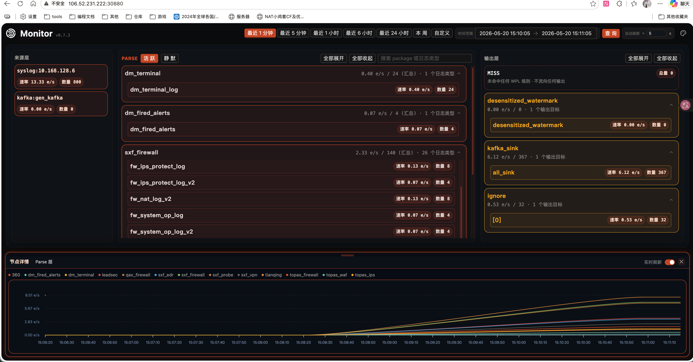
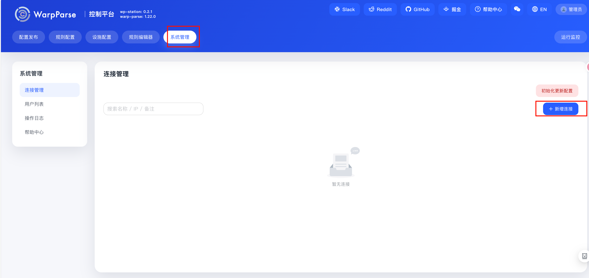
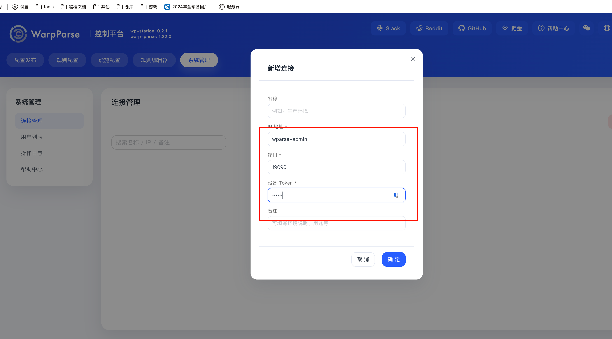
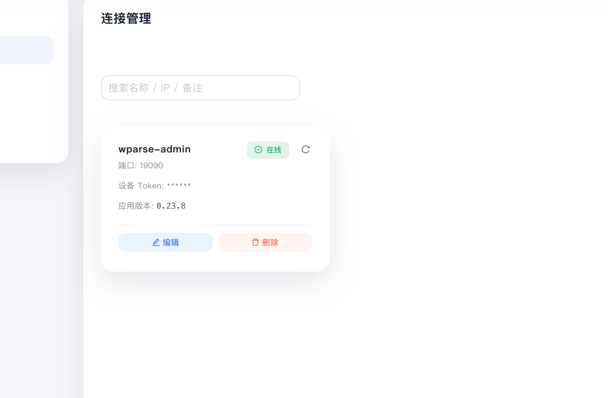

### 前提介绍
请在`/root/wp-stack`目录中解压物料包。

### 下载镜像包和helm包
1. 在k8s所有机器上下载制品物料包，并解压。
```bash
wget https://nexus.corp.dy-sec.com/repository/dysec-general-anonymous/minhang/product-1.2.tgz
tar -zxvf product-1.2.tgz
# 进入到工作目录
cd product
```
物料包解压后目录结构如下所示：
```bash
product
├── helm
│   ├── wp-monitor
│   ├── wp-station
│   └── wparse
├── default-configs   # 生产环境的默认配置
│   ├── conf
│   ├── connectors
│   ├── models
│   └── topology
├── wparse            # 生产环境的实际配置
│   ├── conf
│   ├── connectors
│   ├── models
│   └── topology
├── deploy-hostpath.sh
├── wp-monitor-amd64-images.tar.gz
├── wp-station-amd64-images.tar.gz
└── wparse-amd64-images.tar.gz
```
2. 进入物料包后，将镜像加载到docker中：
```bash
gunzip -c wparse-amd64-images.tar.gz | docker load
gunzip -c wp-station-amd64-images.tar.gz | docker load
gunzip -c wp-monitor-amd64-images.tar.gz | docker load
```
3. 在集群的其他机器上也执行上面第1步和第2步的操作，确保每台机器上都有镜像。
    - 执行命令`kubectl get nodes`，查看所有集群机器。
    ```bash
    [root@dayu01 product]# kubectl get nodes 
    NAME                STATUS   ROLES    AGE    VERSION
    dayu01.shmh.dysec   Ready    master   197d   v1.19.5
    dayu02.shmh.dysec   Ready    master   197d   v1.19.5
    dayu03.shmh.dysec   Ready    master   197d   v1.19.5
    ```
    - 登录其他机器
    - 重复上面第1步和第2步的操作。

## 一键式部署

进入物料包目录：

```bash
cd /root/wp-stack/product
```

首次执行前，给部署脚本增加执行权限：

```bash
chmod +x deploy-hostpath.sh
```


### 安装命令

部署到默认 namespace：

```bash
./deploy-hostpath.sh
```

执行脚本后，根据提示填写目录。直接回车会使用默认目录：

- wparse 宿主机目录位置，默认[/root/wp-stack/product/wparse]
- default-configs的宿主机位置，默认[/root/wp-stack/product/default-configs]
- 持久化根目录：[/data]

### 验证monitor

- 进入到wparse目录
```bash
cd wparse/
```
- 启动wpgen
```bash
wpgen sample -n 1000 --stat 1 -p
```
- 等待一分钟后访问宿主机monitor端口：30880查看效果


### 验证station
**验证**：访问宿主机 30881端口
- 登录：用户名为admin，密码为123456

- 创建一个连接，设备token为123456
    - ip: wparse-admin
    - 端口:19090
    - token：123456



- 显示为在线即成功



### 配置k8s config文件路径
使用环境变量`KUBECONFIG`指定k8s config文件路径，默认为`~/.kube/config`。如果你的config文件不在默认位置，可以通过设置这个环境变量来指定路径。例如：

```bash
KUBECONFIG=/etc/kubernetes/admin.conf ./deploy-hostpath.sh
```