### 前提要求
已经一键部署了默认的wparse和wp-monitor和wp-station。

### monitor相关

#### 接入monitor
**在wparse中添加两个连接器**
- VictoriaMetrics connector
```bash
vim wparse/connectors/sink.d/80-victoriametrics.toml
```
使用下面配置覆盖掉该文件
```toml
[[connectors]]
id = "victoriametrics_sink"
type = "victoriametrics"
allow_override = ["endpoint", "api_path", "timeout_secs","batch_size"]
[connectors.params]
endpoint = "http://victoria-metrics:8428"
api_path = "/api/v1/import/prometheus"
timeout_secs = 3
```

- VictoriaLogs connector
``` bash
vim wparse/connectors/sink.d/70-victorialogs.toml
```
使用下面配置覆盖掉该文件
```toml
[[connectors]]
id = "victorialogs_sink"
type = "victorialogs"
allow_override = ["endpoint", "api_path", "flush_interval_secs", "create_time_field","batch_size","tags"]
[connectors.params]
endpoint = "http://127.0.0.1:9428"
api_path = "/insert/jsonline"
flush_interval_secs = 3
```

**在 sink_group 中接入监控**

``` bash
vim wparse/topology/sinks/infra.d/monitor.toml
```
使用下面配置覆盖掉该文件
```toml
[sink_group]
name = "monitor"

[[sink_group.sinks]]
name = "metrics_vmetrics_sink"
connect = "victoriametrics_sink"
[sink_group.sinks.params]
endpoint = "http://wp-monitor-victoria-metrics:8428"
api_path = "/api/v1/import/prometheus"
```

**在 sink_group 中接入miss数据**
```bash
vim wparse/topology/sinks/infra.d/miss.toml
```
使用下面配置覆盖掉该文件
```toml
[sink_group]
name = "miss"

[[sink_group.sinks]]
name = "victorialogs_output"
connect = "victorialogs_sink"
[sink_group.sinks.params]
endpoint = "http://wp-monitor-victoria-logs:9428"
api_path = "/insert/jsonline?_msg_field=content,log"
tags = ["wp_stage:miss"]
```

### wparse相关
#### 配置wparse的配置目录位置
    - 设置helm中`wparse.config.path`的如下配置：
    ```bash
    vim helm/wparse/values.yaml
    ```
    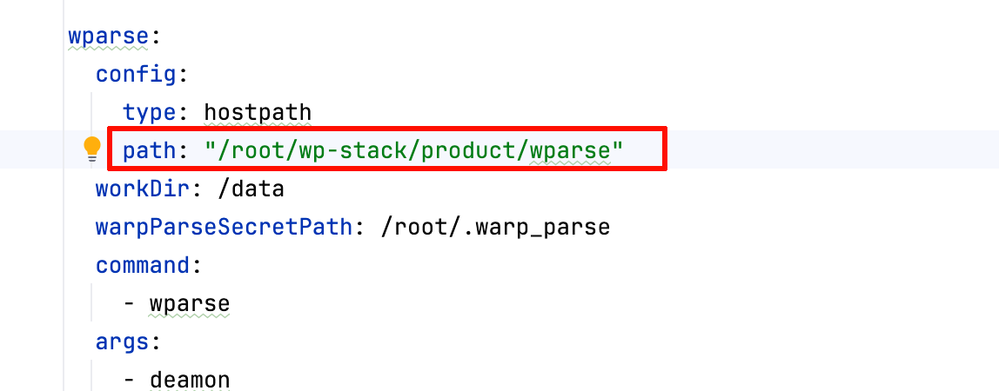
#### 配置wparse的source端口
wparse source中的端口需要暴露给外部访问，因此需要将source用到的端口**追加**到`wparse.service.ports`中。
    ``` bash
    vim helm/wparse/values.yaml
    ```
    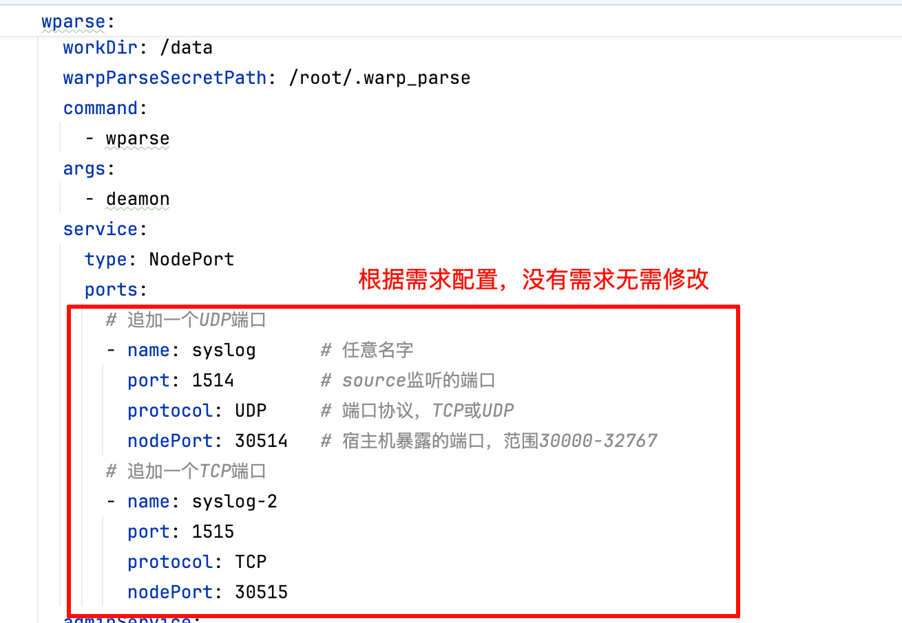

### 部署station
#### gitea和pg的持久化目录配置
- 配置pg和gitea的持久化目录，将图片中的路径改为实际路径(如果使用默认路径则无需修改):
  ```bash
  vim helm/wp-station/values.yaml
  ```
  ```yaml
  postgres:
    persistence:
      path: "/data/postgres"
  gitea:
    persistence:
      path: "/data/gitea"
  ```
  - pg
  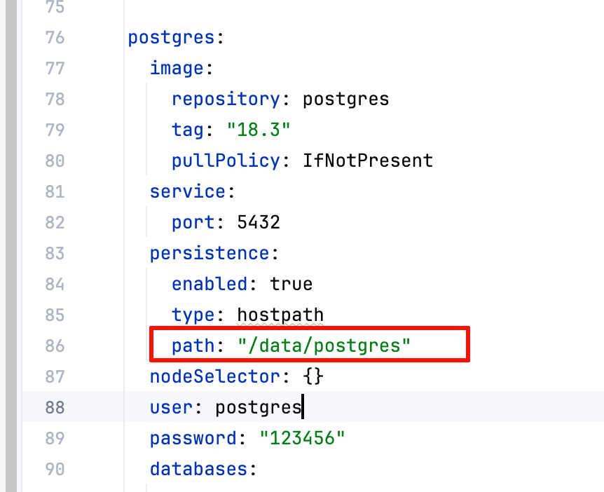
  - gitea
  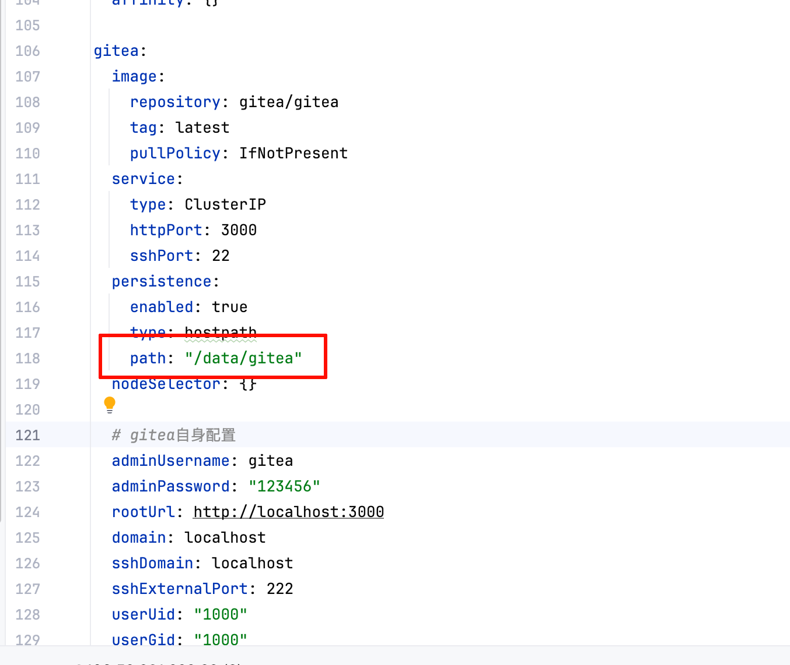
- 配置wp-station的默认wparse配置：
    - 将实际的default-configs目录覆盖掉默认的`default-configs`目录（如果有）。
    - 查看上面物料包中default-configs的绝对路径：
    ```bash
    realpath default-configs/
    ```
    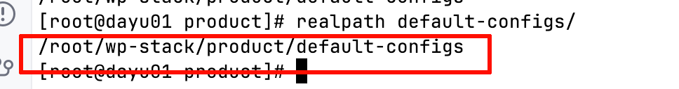
    - 设置helm中wp-station的default-configs目录为上面查询到的绝对路径：
    ```bash
    vim helm/wp-station/values.yaml
    ```
    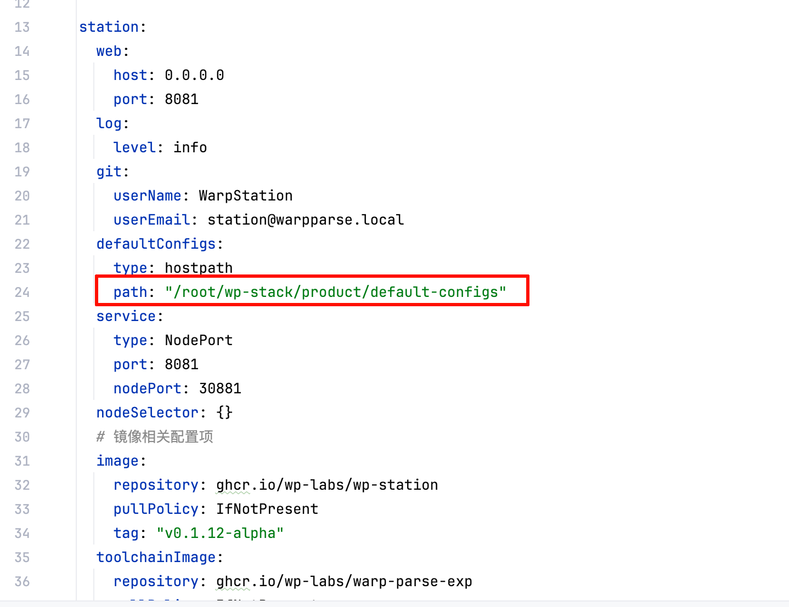
- 配置当前节点运行,在nodeSelector中设置当前节点：
    - 查看当前节点的名称:`hostname`
    - 设置station、pg、gitea的nodeSelector为当前节点的名称：
    ``` bash
    vim helm/wp-station/values.yaml
    ```
    将nodeSelector中的`kubernetes.io/hostname`,配置为当前节点名称(用hostname的结果替换掉`dayu01.shmh.dysec`)：
    ```yaml
    station:
      nodeSelector:
        kubernetes.io/hostname: dayu01.shmh.dysec
    pg:
      nodeSelector:
        kubernetes.io/hostname: dayu01.shmh.dysec
    gitea:
      nodeSelector:
        kubernetes.io/hostname: dayu01.shmh.dysec
    ```
    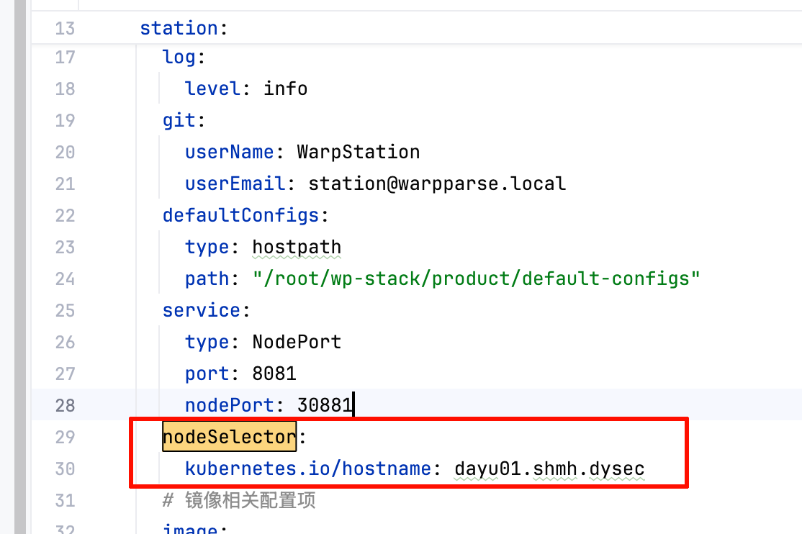
    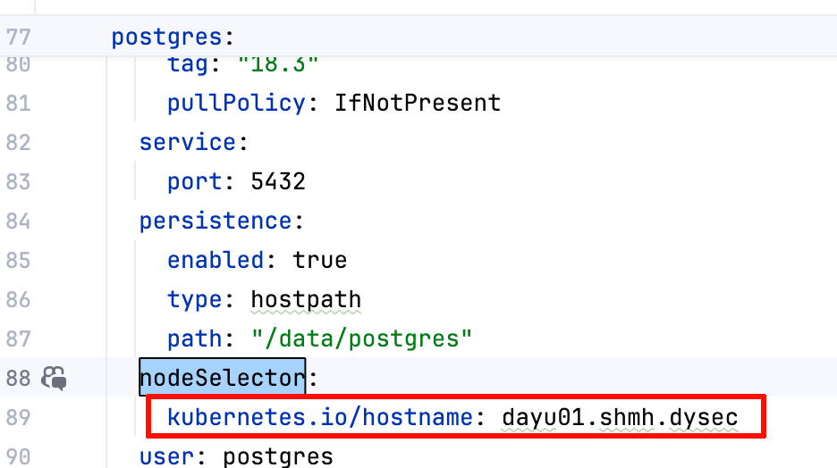
    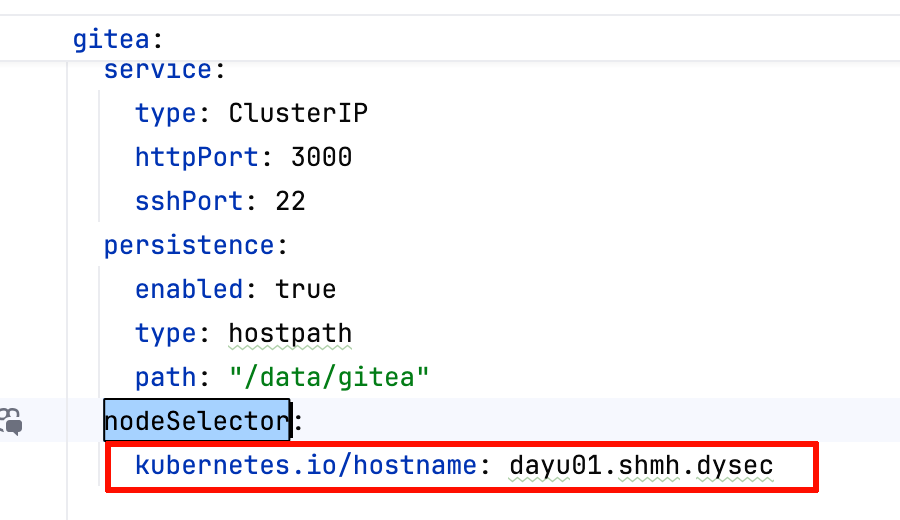

### 暴露端口
- monitor：宿主机30880,容器18080.
- vlogs: 宿主机30429,容器9428.
- vmetrics: 宿主机30428,容器8428.
- station：宿主机30881,容器8081。
- wparse syslog监听端口：宿主机30514,容器1514(source监听端口)。
- wparse admin模块监听端口：宿主机30090,容器19090(admin api)。

### 深度定制
#### 指定monitor镜像

- 配置monitor镜像:修改values文件的`wpMonitor.image`的repository和tag。
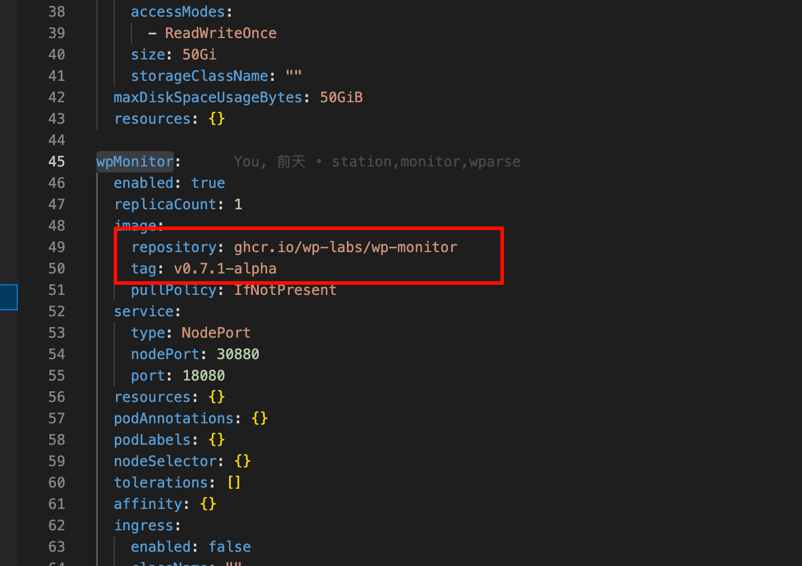
#### 指定monitor端口
- 默认监听宿主机30880端口，通过`wpMonitor.service.nodePort`配置
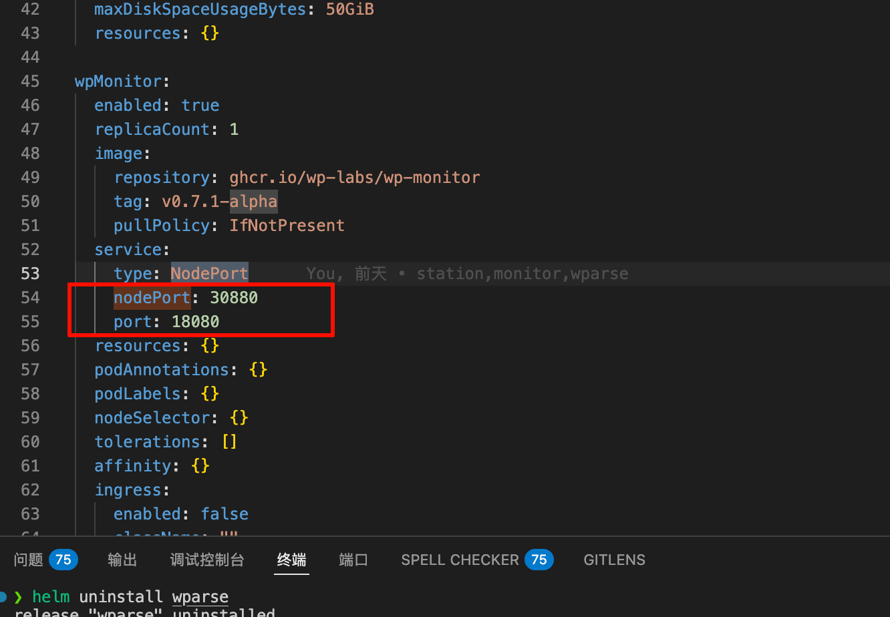

#### 指定wparse镜像
- 配置wparse镜像:修改values文件的`wparse.image`的repository和tag
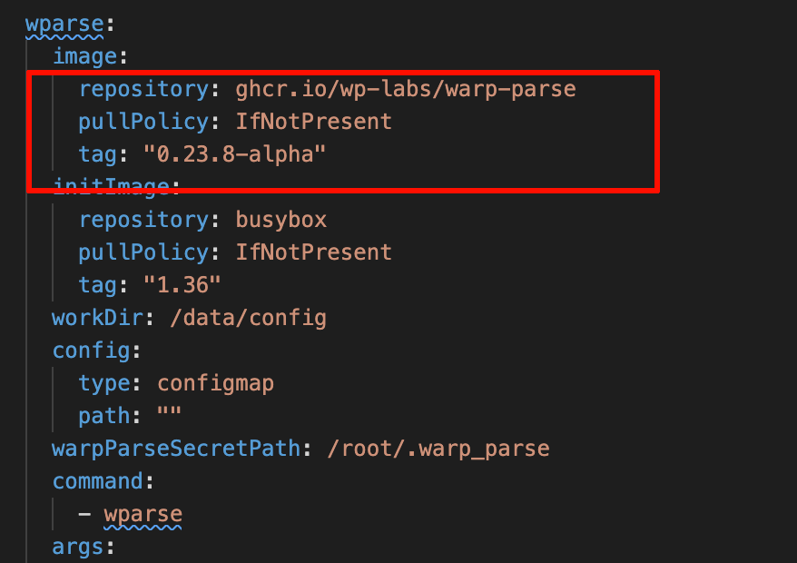
#### 部署wparse证书
- 布置证书：将tls证书放到`helm/wparse/.warp_parse/tls`目录下，将`admin_api.token`放到`helm/wparse/.warp_parse`目录下。

### 指定wp-station镜像
- 配置station镜像:修改values文件的`station.image`的repository和tag
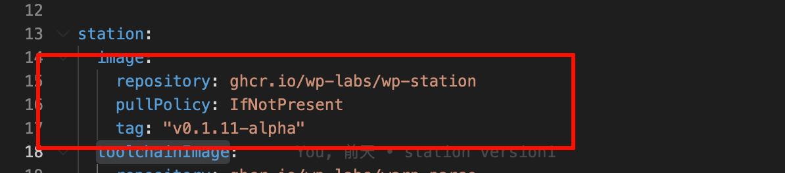
- 配置工具链镜像：修改values文件的`station.toolchainImage`的repository和tag
- 配置monitor端口：在`station.monitorUrl`中填写wp-monitor地址到`data_collect_url`中（monitor的宿主机ip+宿主机端口）。
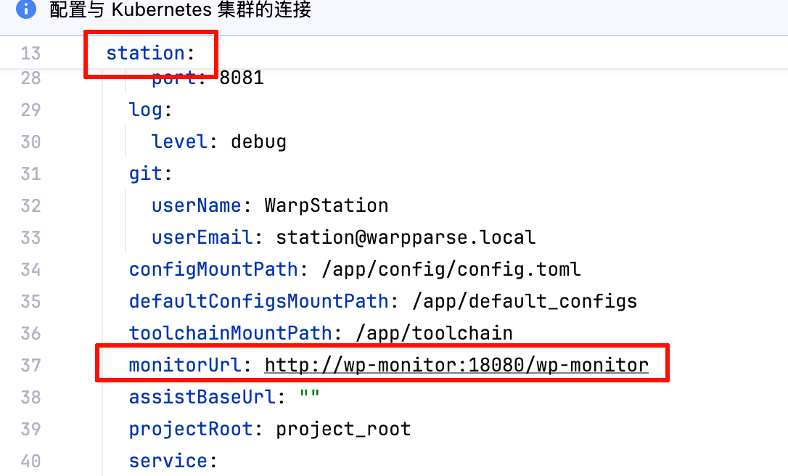
### station端口配置
- 端口配置：station默认监听宿主机的30881端口，可以通过`station.service.nodePort`配置。